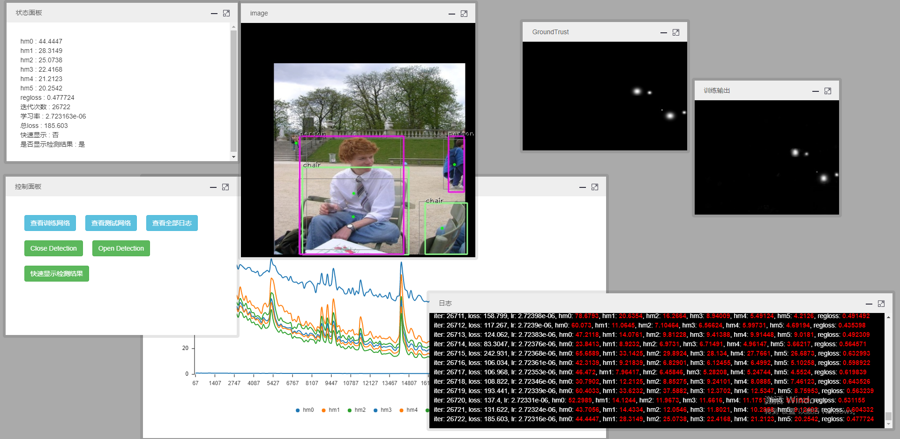

## ccboard v1.0
* 1、基于caffe的可视化框架
* 2、测试代码如下，一般while(true)是指训练的solver->solve()，然后卡住main函数进程。postStatus类函数在stepEnd回调中调用

```
void notifyListener(const string& action){
    if (action == "testAction1"){
        printf("点击了按钮1\n");
    }
}

int main(){

    registerServiceNotify(notifyListener);

    auto configResult = systemConfig("name: \"Train Network\"", "name: \"Test Network\"", {
        NotifyAction("testAction1", "测试按钮1", "notify", "info"),
        NotifyAction("openURL('http://www.baidu.com')", "测试按钮2", "code", "success")
    });
    cout << configResult << endl;

    int i = 0;
    while (true){
        postStatus("i = ", cc::f("%d", i));
        postString("测试日志", cc::f("测试输出%d", i));
        postChartValue("测试图表1", "Loss", i, rand() / (float)RAND_MAX);
        postChartValue("测试图表2", "Lr", i, rand() / (float)RAND_MAX);

        std::this_thread::sleep_for(std::chrono::milliseconds(1000));
        i++;
    }
    return 0;
}
```

# 可视化
* 支持：
* 1、显示图像
* 2、显示图表，例如学习率等
* 3、显示状态信息
* 4、注册action，web上回调到c++
* 5、显示日志

* 框架采用flask通过中间件（C++）实现调用，执行时需要ccboard.exe train.dll的方式实现，train.dll则是以int main()为入口，包含了visualize-py.h的DLL程序
* 效果如下

