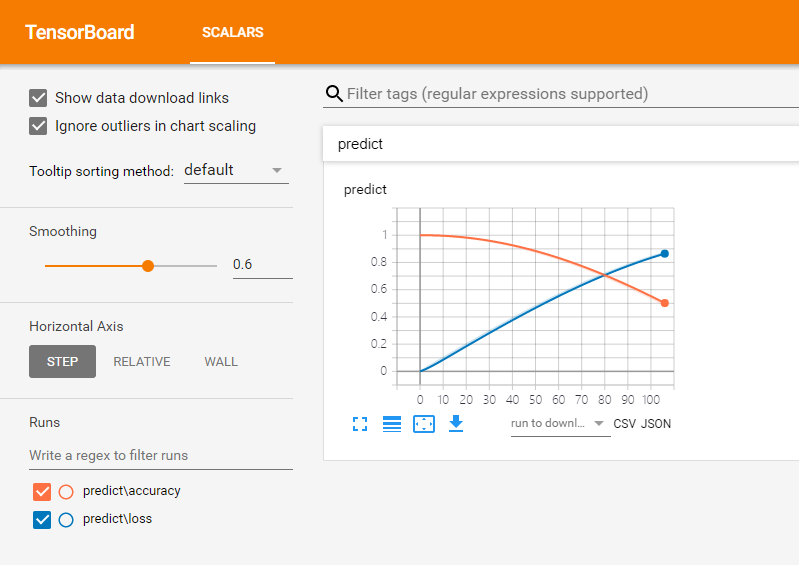

* 1、先安装tensorflow（cpu版本即可）：pip install tensorflow
* 2、然后安装tensorboard：pip install tensorboard
* 3、程序编译启动后，执行如下指令：
   * tensorboard --logdir=E:\CC5.0ReleaseGithub\release\tensorboard\workspace\logs
   * 后面的路径是workspace下的logs目录即可看到tensorboard输出的两条曲线，可以自己自由控制

   * 效果图如下：
   